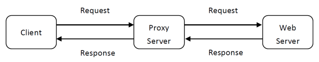
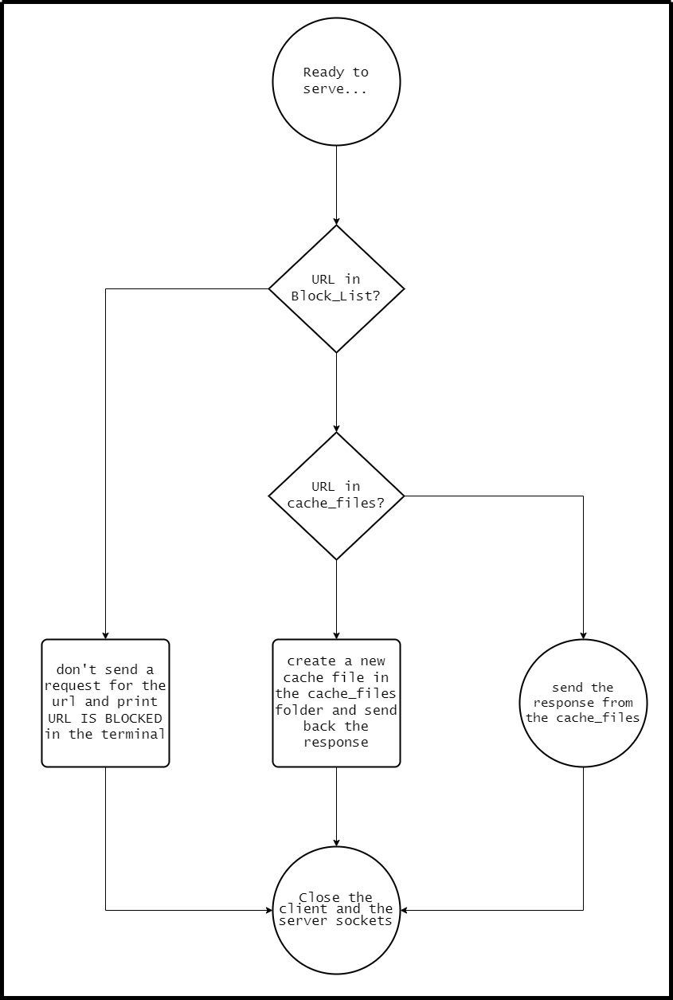
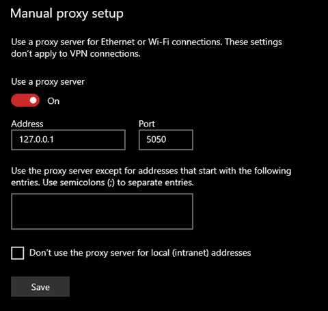
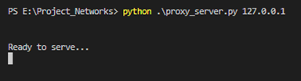

# Hello People

This repository is made for CSE351 Computer Networks major task, "HTTP Web Proxy Server with a blacklist URL filter"

 

# Overview
> System Diagram

The client sends request via the proxy server, then the proxy server forwards it to the web server, 
the web server then creates a response message and sends it to the proxy server, eventually 
sending it to the client

 

> Our design of the system flow

After we connect to our preferred address and port number, we create a socket and bind it to the port and start listening to serve, waiting the client to request

 

# Features
## The URL filter:
First, we check if the URL is in the block list or not and if the message is empty or not, if it’s blocked then we abort the request and close the socket, it will show in the browser that the page is not found and print in the terminal that the URL is blocked
The filter is a file called Blocked_List.txt containing the URLs that we want to block each in a single line with no spaces

## The Caching:
The proxy server caches every URL request it gets and it checks if the requested URL/object is cached or not
If yes, we return it from the cache_files without contacting the server
If not, we get the URL/object from the server and return it to the client and create a new cache file for it in the cache_files

 

# Before Starting

>Note: 
Before running our code we first must turn on our manual proxy setup with the Address and Port number we specified.
And you have to create a block_List.txt file  
And a cache_files folder before running 

>Now we can run our code with the following command followed with the address

